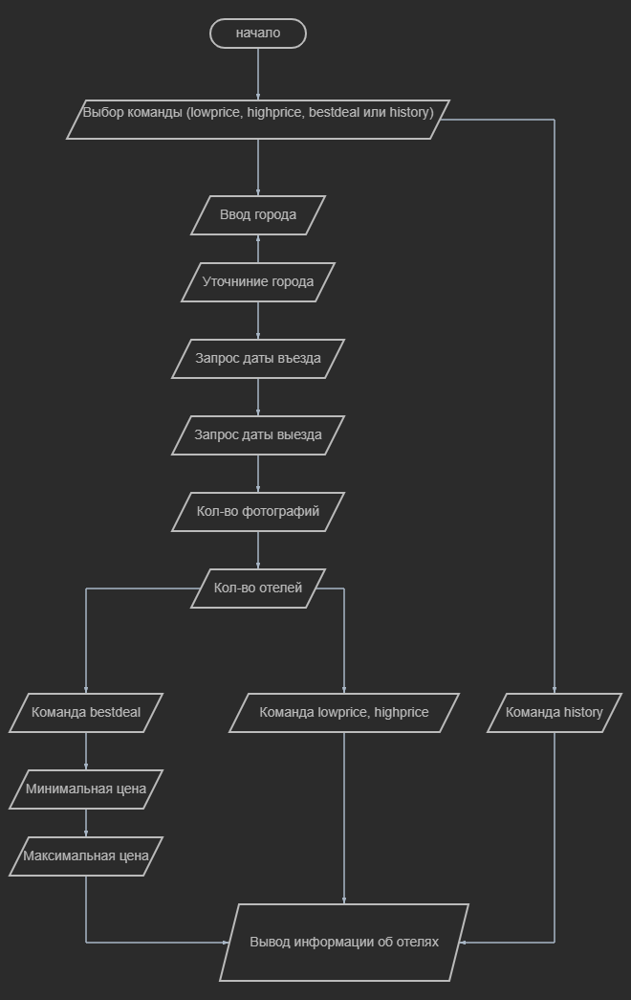
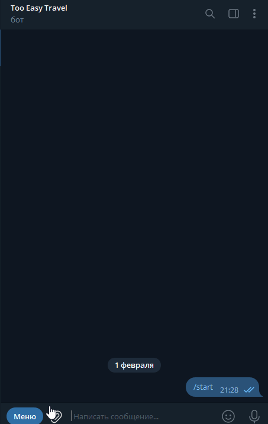

# Телеграмм-бот для поиска отелей на сайте Hotel.com

Основные команды:
- lowprice - Вывод самых дешёвых отелей в городе (ТОП дешевых)
- highprice - Вывод самых дорогих отелей в городе (ТОП дорогих)
- bestdeal - Вывод отелей, наиболее подходящих по цене и расположению от центра (ТОП лучших)
- history - Вывод истории поиска отелей

# Запуск телеграм-бота:
- Клонируйте репозиторий
- Убедитесь, что установлен python 3.11
- Установите необходимые зависимости (pip install -r requirements.txt)
- Создайте файл .env и добавьте свой TOKEN бота, RAPID_API_KEY и RAPID_HOST (образец [env.template](env.template))

# Получение RAPID_API_KEY и RAPID_HOST
- Необходимо зарегистрироваться на сайте [rapidapi](https://rapidapi.com/)
- Перейти в API Marketplace → категория Travel → Hotels (либо просто перейти по прямой ссылке на документацию
[Hotels API Documentation](https://rapidapi.com/apidojo/api/hotels4/))
- Нажать кнопку Subscribe to Test
- Выбрать бесплатный пакет (Basic)

# Получение TOKEN:
- Обратитесь для получения TOKEN к [BotFather](https://t.me/BotFather)
- [Получите свой Токен бота](https://core.telegram.org/bots/tutorial#obtain-your-bot-token)

# Описание:

Телеграм-бот максимально старается минимизировать обращения к API. При наличии информации в базе данных, будет выведена
информация из базы данных.   
Бот записывает все найденные отели в городе. (Без адреса и фотографий).  
Стоимость проживания добавляется при запросе города. Обновляется при запросе города, если
дата добавления отличается от текущей.   
После запроса необходимой информации бот проверяет наличие адреса у отеля в базе данных.
Если адрес отсутствует, то делается запрос к API для получения адреса отеля и фотографий. 
Проверяется команда пользователя и выводится соответсвующий список отелей. 

# Блок-схема

# Пример работы бота
Команда lowprice  
  
  

Команда bestdeal  
